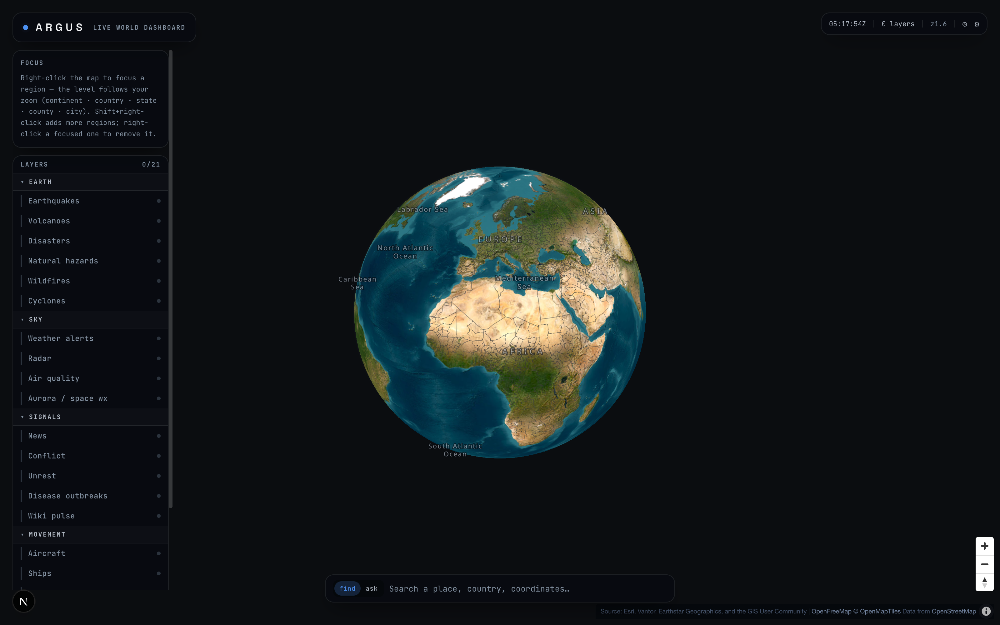

# ARGUS — live world dashboard

An open-source, keyless-first geospatial situational-awareness globe: live
public data only, rendered on a MapLibre globe, operated by hand or by an AI
agent with full tool parity. Think "open Palantir built strictly on legal,
public feeds."



> Focus any region and layers stream for that area only — here San Francisco
> with live aircraft and traffic cameras over the satellite skin, plus an
> auto-generated SITREP.


```
┌──────────────────────────────────────────────────────────────────┐
│  EARTH     earthquakes · volcanoes · disasters · hazards ·       │
│            wildfires · cyclones                                  │
│  SKY       weather alerts (NWS + MeteoAlarm) · radar ·           │
│            air quality · aurora / space weather                  │
│  SIGNALS   news · conflict · unrest (GDELT) · health (WHO) ·     │
│            wikipedia pulse                                       │
│  MOVEMENT  aircraft (3-source ADS-B) · ships (AIS, keyed) ·      │
│            satellites · launches                                 │
│  GROUND    traffic cameras + webcams · street imagery            │
│            (Panoramax / Mapillary)                               │
└──────────────────────────────────────────────────────────────────┘
```

## Quick start

```bash
pnpm install
pnpm dev          # → http://localhost:3000
```

Everything renders keyless out of the box. Optional free keys unlock extras
(fresher wildfires, ships, wider street imagery, the AI agent) — see
[KEYS.md](KEYS.md).

## Using it

- **Select an area** — double-click a country, use the omnibox (Find), or ask
  the agent. Nothing loads until an area is set; layers stream for that region
  only.
- **Layers** — toggle in the left rail, filter below it. Zoom gates visibility;
  hidden tabs pause all fetching.
- **Entities** — click any dot for a live panel (cameras play HLS streams).
  Right-click ground for a place card; double-tap opens the detail workspace.
- **Ask mode** — the agent does everything you can do by hand: focus real
  boundaries, toggle/filter/count layers, select & track planes and ships,
  open cameras, build situation reports, search the web.
- **Watches** — get a browser notification when a matching event appears.
- **Playback** — scrub the last 24 h of time-stamped event layers.

## Stack

Next.js 16 · React 19 · MapLibre GL 5 · Zustand · Tailwind 4 · satellite.js ·
hls.js · GSAP. Server routes are thin normalizing proxies with s-maxage
caching and circuit breakers; no database, no accounts, no tracking.

## Tests

```bash
pnpm test    # vitest
pnpm lint
```

## Data & legality

Every feed is public and free to use (government agencies, NASA/NOAA/USGS,
GDELT, Wikimedia, OpenStreetMap ecosystem, state DOTs). Provider catalogs live
in `src/layers/feeds/` — coverage grows by appending rows, not writing code.
